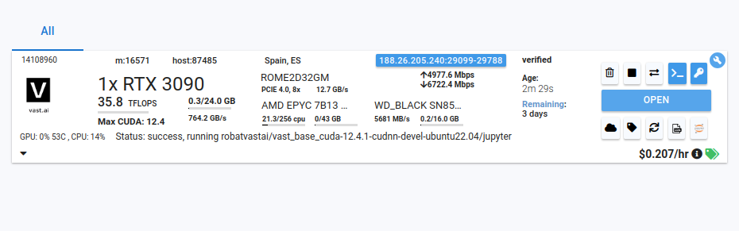
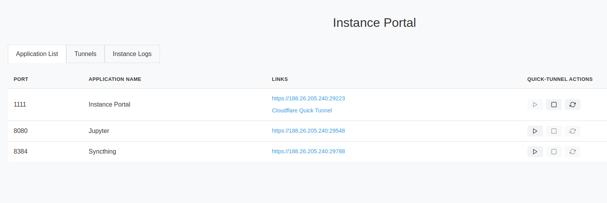
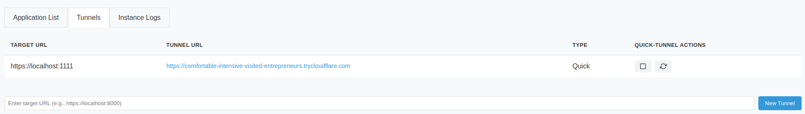
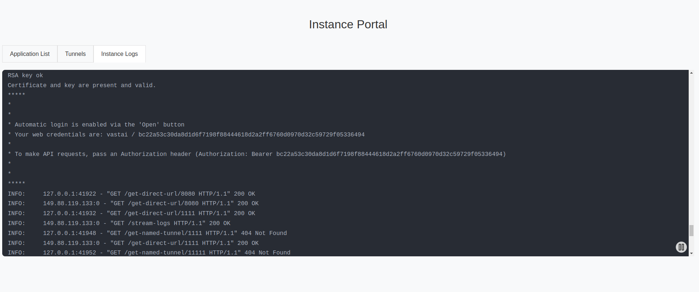

# Vast.ai Base Docker Image

Welcome to the Vast.ai base Docker image project! This repository provides everything you need to build a versatile Docker image that works seamlessly with both Nvidia CUDA (supporting AMD64 & ARM64 architectures) and AMD ROCm (AMD64) instances on [Vast.ai](https://vast.ai).

Getting started is easy - you can either:
- Use our pre-built images from [DockerHub](https://hub.docker.com/repository/docker/vastai/base-image/tags), perfect for extending with your own customizations
- Build the image from scratch by cloning this repository

Our pre-built images are based on either [nvidia/cuda](https://hub.docker.com/r/nvidia/cuda/tags) or [rocm/dev-ubuntu-22.04](https://hub.docker.com/r/rocm/dev-ubuntu-22.04/tags). While these are substantial images, you'll find they start up quickly on most host machines thanks to Docker's layer caching system - Many of our recommended templates will be derrived from this base image.

## Key Features

Our base image comes packed with features designed to make your development experience smoother:

**Platform Support**
- Multi-architecture compatibility (AMD64/ARM64)
- Launch flexibility with Jupyter, SSH, and Args modes
- Full support for CUDA, OpenCL & ROCm

**Development Tools**
- Built-in [Vast CLI](https://pypi.org/project/vastai/) for seamless instance management
- Python virtual environment pre-configured in `/workspace`
- Non-root `user` account for applications with root restrictions
- Extensive application suite for remote development

**Security & Connectivity**
- [Instance Portal](#instance-portal) providing TLS, secure tunnels, and authentication
- Workspace portability between instances (including Python packages)
- [Supervisor](https://supervisord.readthedocs.io/en/latest/) for reliable application management

**Customization**
- Remote configuration support via `PROVISIONING_SCRIPT` environment variable
- Easy to extend with additional applications and tools

## Instance Portal

The Instance Portal is your gateway to managing web applications running on your instance. It uses [Caddy](https://caddyserver.com/) as a reverse proxy to provide secure TLS and authentication for all your applications.

### Getting Started

1. **Set Up TLS**: To avoid certificate warnings, install the 'Jupyter' certificate by following our [instance setup guide](https://vast.ai/docs/instance-setup/jupyter#installing-the-tls-certificate).

2. **Launch Applications**: When starting web applications, configure them to listen on `localhost`. Don't expose ports directly (`-p port:port`) - Caddy will handle this using TLS certificates stored at `/etc/instance.crt` and `/etc/instance.key`.

3. **Access Your Applications**: Simply click the 'Open' button on your instance card:



This sets a cookie using your `OPEN_BUTTON_TOKEN`, granting you access. Without this, you'll see a login prompt (username: `vastai`, password: your `OPEN_BUTTON_TOKEN`).

### Programmatic Access

For automated or API access, you can authenticate to any application by including a Bearer token in your HTTP requests:

```bash
Authorization: Bearer ${OPEN_BUTTON_TOKEN}
```

This is particularly useful for scripts, automated tools, or when you need to access your applications programmatically without browser interaction.
Once logged in, you'll see your application dashboard:



The dashboard shows all available ports and their corresponding applications. The Instance Portal automatically creates Cloudflare tunnels - perfect for sharing temporary application links or accessing your instance when direct connections aren't available.

Start, stop, and refresh tunnel links using the dashboard controls.

### Managing Tunnels



The Tunnels tab displays your active Cloudflare tunnels. You can:
- View existing tunnels linked to running applications
- Create new 'quick tunnels' to any local port
- Test applications without opening ports on your instance

Tunnels displayed in this tab will show the direct mapping between the local and tunnel addresses.  Authentication tokens will not be appended so clicking these may lead to an authentication dialog if the auth cookie has not already been set from a previous visit.

Want to use custom domains or virtual networks? Set the `CF_TUNNEL_TOKEN` environment variable to enable domain mapping. Check out the [Cloudflare documentation](https://developers.cloudflare.com/cloudflare-one/connections/connect-apps/) for details.

### Monitoring Your Instance



The Logs tab provides live streaming of all `*.log` files from `/var/log/portal/`. Outputs for the included applications are piped to `tee -a /var/log/portal/${PROC_NAME}.log`, making them accessible both within your instance and through the Vast GUI logging button.

### Configuration

The Instance Portal configuration lives in `/etc/portal.yaml`, generated on first start using your `PORTAL_CONFIG` environment variable.

Default configuration:
```yaml
# Default PORTAL_CONFIG="localhost:1111:11111:/:Instance Portal|localhost:8080:8080:/:Jupyter|localhost:8384:18384:/:Syncthing"

applications:
  Instance Portal:
    hostname: localhost
    external_port: 1111
    internal_port: 11111
    open_path: /
    name: Instance Portal
  Jupyter:
    hostname: localhost
    external_port: 8080
    internal_port: 8080 # Internal port = External Port: No proxying, only links
    open_path: /
    name: Jupyter
  Syncthing:
    hostname: localhost
    external_port: 8384
    internal_port: 18384
    open_path: /
    name: Syncthing
```

Need to modify the configuration in a running instance? Edit `/etc/portal.yaml` anytime, then restart Caddy with `supervisorctl restart caddy`. Remember that any new applications will need their external ports to be available for direct access.

## Applications & Startup

The container starts with `/opt/instance-tools/bin/entrypoint.sh`, which handles the initial setup and launches your workspace environment. Here's what happens during startup:

### Startup Sequence

1. **Environment Setup**
  - Configures Jupyter management via Supervisor if requested
  - Stores environment variables in `/etc/environment` for login shell access
  - Creates `/.provisioning` lock file for safe application startup
  - Sets up SSH keys for non-root access

2. **Workspace Preparation**
  - Copies internal directory `/opt/workspace-internal` to `${WORKSPACE}` on first boot allowing for full rsync backup
  - Generates TLS certificates if needed
  - Starts Supervisor in the background

3. **Custom Configuration**
  - Downloads and executes any script defined in `PROVISIONING_SCRIPT`. Find the downloaded script at `/provisioning.sh`
  - Removes the `/.provisioning` lock
  - Maintains the container process until Supervisor stops

### Application Management with Supervisor

We use Supervisor to orchestrate applications in the container. Configuration files live in `/etc/supervisor/conf.d/`, with startup scripts in `/opt/supervisor-scripts/`.

Rather than direct application launches, we use wrapper scripts for better control. This allows us to check for application entries in `/etc/portal.yaml` - if an application isn't configured, we assume you don't want to run it.

Common Supervisor commands:
```bash
# View all processes
supervisorctl status

# Control specific services
supervisorctl start jupyter
supervisorctl stop syncthing
supervisorctl restart caddy

# Reload configuration after changes
supervisorctl reload

# Read recent logs
supervisorctl tail jupyter
supervisorctl tail -f syncthing  # Follow mode
```

Need more details? Check out the [Supervisor documentation](https://supervisord.readthedocs.io/en/latest).

### Built-in Applications

#### Jupyter

The industry standard for interactive Python development. Perfect for prototyping, data analysis, and machine learning experiments. Our setup supports:
- Starts via Instance Portal in SSH or Args launch modes
- Requires internal port `18080` in `PORTAL_CONFIG` (handled automatically)
- In Jupyter launch mode, managed by `/.launch` script instead
- Customize configuration in `ROOT/opt/supervisor-scripts/jupyter.sh`

### Caddy

The Caddy web server is used to enable both HTTPS and authentication for exposed web applications.

Each application launched by this docker image will bind to `localhost` rather than the external interface.  Caddy will instead bind to the external interface and it will act as a reverse proxy to serve the application.

This setup makes it straightforward to access the application securely over the internet while still being able to connect without TLS or authentication via SSH Port Forwarding.

#### Syncthing

A powerful file synchronization tool that keeps your development environment in sync across devices. Ideal for maintaining consistent workspaces across multiple instances or syncing datasets. Features:
- Peer-to-peer file synchronization
- Real-time file updates
- Conflict resolution
- Selective sync options

See the [Syncthing documentation](https://docs.syncthing.net/) for setup instructions.

#### Tensorboard

Visualization toolkit for machine learning experiments, helping you track metrics, view model graphs, and analyze training results. Our configuration:
- By default, monitors `/workspace`
- Customize log directory via `TENSORBOARD_LOG_DIR` environment variable
- Automatically detects and displays new experiments

#### Cron

The reliable Linux task scheduler, perfect for automating routine tasks in your instance:
- Schedule model training jobs
- Automate data downloads
- Run periodic maintenance tasks
- Enabled in all launch modes
Just add entries to your crontab to get started.

### OpenCL

A standardized framework for parallel programming across heterogeneous computing platforms. Ideal for high-performance computing tasks that can leverage GPUs, CPUs, and other processors. Features:
- Cross-platform compatibility
- Hardware-agnostic code execution
- Support for data and task parallelism
- Memory management optimization

#### NVM (Node Version Manager)

Manages Node.js environments, essential for many modern AI tools and visualization frameworks:
- Pre-installed with latest LTS Node.js version
- Supports popular ML visualization tools like TensorBoard.js
- Enables local development of model visualization dashboards
- Compatible with various AI/ML web interfaces and tools


## Building Your Own Image

Getting started with our base image is straightforward - you don't need a GPU for the build process! GPUs are only required when running the container.

### Quick Start

```bash
# Clone and build
git clone https://github.com/vast-ai/base-image
cd base-image
docker buildx build --build-arg BASE_IMAGE=nvidia/cuda:12.1.1-cudnn8-devel-ubuntu22.04 --build-arg PYTHON_VERSION=3.10 .
```
Want to use a different base image? Just pass the `BASE_IMAGE` build argument during build.

Optionally, pass build argument `PYTHON_VERSION` to set the Python version for the main virtual environment.

### Creating Custom Images

Need to add your own tools and configurations? Use our image as your starting point:

```dockerfile
FROM vastai/base-image:<TAG>
```

#### Tips for customizing:

- Install your Python packages into `/venv/main/`
- Add Supervisor config files for any new services
- Create wrapper scripts for your services (check out our Jupyter and Syncthing scripts as examples)


## Dynamic Templates

Sometimes you need flexibility without rebuilding the entire image. For quick customizations:

Host a shell script remotely (GitHub, Gist, etc.)
Set the raw URL in `PROVISIONING_SCRIPT`

Here's a typical provisioning script:

```bash
#!/bin/bash

# Cause the script to exit on failure.
set -eo pipefail

# Activate the main virtual environment
. /venv/main/bin/activate

# Install your packages
pip install your-packages

# Download some useful files
wget -P /workspace/ https://example.org/useful-files.tar.gz

# Set up any additional services
echo "your-supervisor-config" > /etc/supervisor/conf.d/your-service.conf
echo "your-supervisor-wrapper" > /opt/supervisor-scripts/your-service.sh
chmod +x /opt/supervisor-scripts/your-service.sh

# Reconfigure the instance portal
rm -f /etc/portal.yaml
PORTAL_CONFIG="localhost:1111:11111:/:Instance Portal|localhost:1234:11234:/:My Application"

# Reload Supervisor
supervisorctl reload
```

Remember to expose the necessary ports and provide a suitable `PORTAL_CONFIG`.

## Template Links

Check out these templates to see the default configuration in action:

[Jupyter Launch Mode](https://cloud.vast.ai/?ref_id=62897&creator_id=62897&name=Vast%20Base%20Image)

[SSH Launch Mode](https://cloud.vast.ai/?ref_id=62897&creator_id=62897&name=Vast%20Base%20Image%20-%20SSH)

[Args Launch Mode](https://cloud.vast.ai/?ref_id=62897&creator_id=62897&name=Vast%20Base%20Image%20-%20ARGS)

[Jupyter (ARM64)](https://cloud.vast.ai/?ref_id=62897&creator_id=62897&name=Vast%20Base%20Image%20-%20ARM64)

[Jupyter (AMD ROCm)](https://cloud.vast.ai/?ref_id=62897&creator_id=62897&name=Vast%20Base%20Image%20-%20AMD%20ROCm)